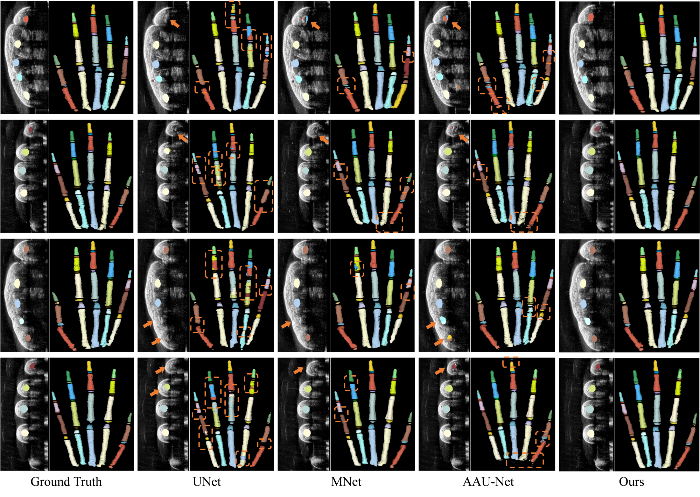
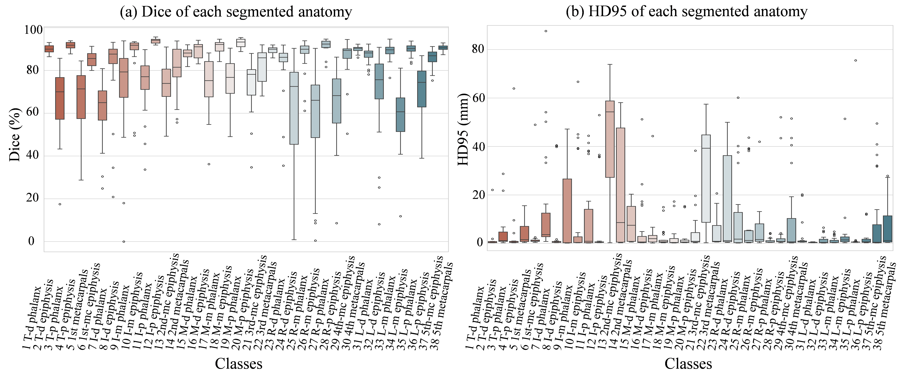
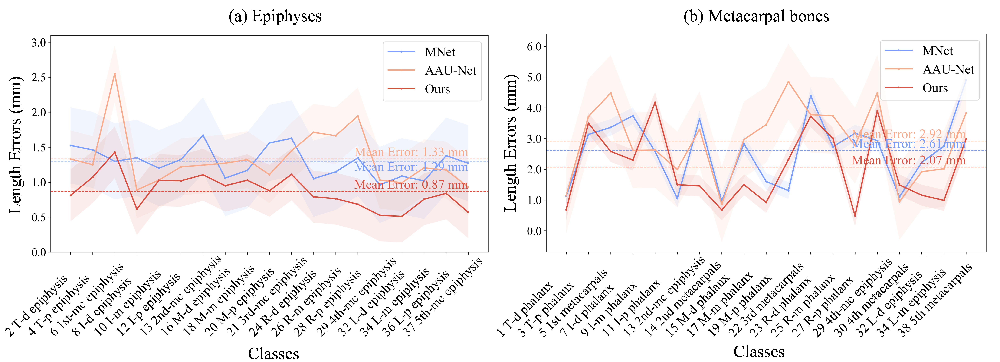

# HandAISegmentation
**Keywords**: 3D ultrasound, hand bone segmentation, contrastive learning, 3D Slicer

This is a **PyTorch** implementation of the paper:  [*Fine-grained Hand Bone Segmentation via Adaptive Multi-dimensional Convolutional Network and Anatomy-constraint Loss.*](https://ieeexplore.ieee.org/document/10505788)

## Architecture
> 

## Extensible module on 3D Slicer
**Coming soon**🥤😉

## Environment
1. Python >= 3.8  
2. Pytorch >=1.12.0

## Example results
**Qualitative results:**
> 

**Quantitative results:**
> 

**Bone length measurement**
> 

 ## Cite
 ~~~
@article{zeng2024adaptive,
  title={Adaptive Multi-dimensional Weighted Network with Category-aware Contrastive Learning for Fine-grained Hand Bone Segmentation},
  author={Zeng, Bolun and Chen, Li and Zheng, Yuanyi and Chen, Xiaojun},
  journal={IEEE Journal of Biomedical and Health Informatics},
  year={2024},
  publisher={IEEE}
}
 ~~~